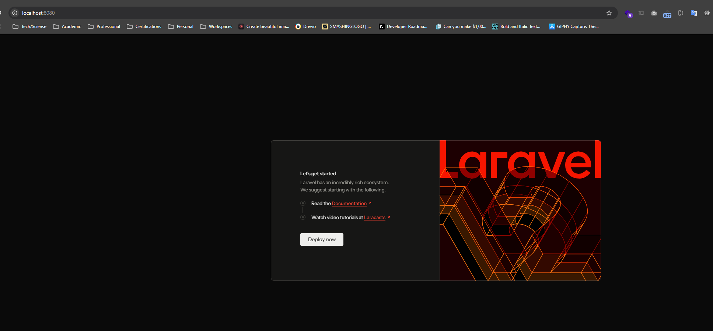
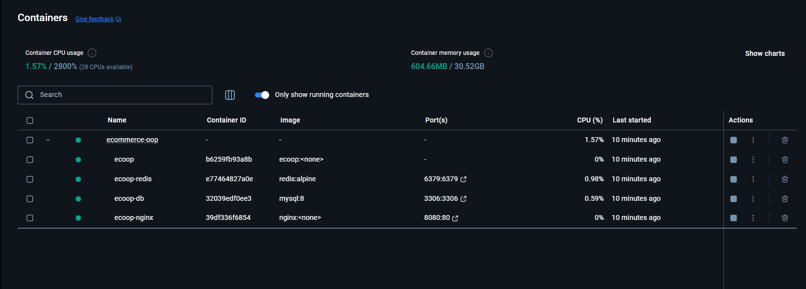
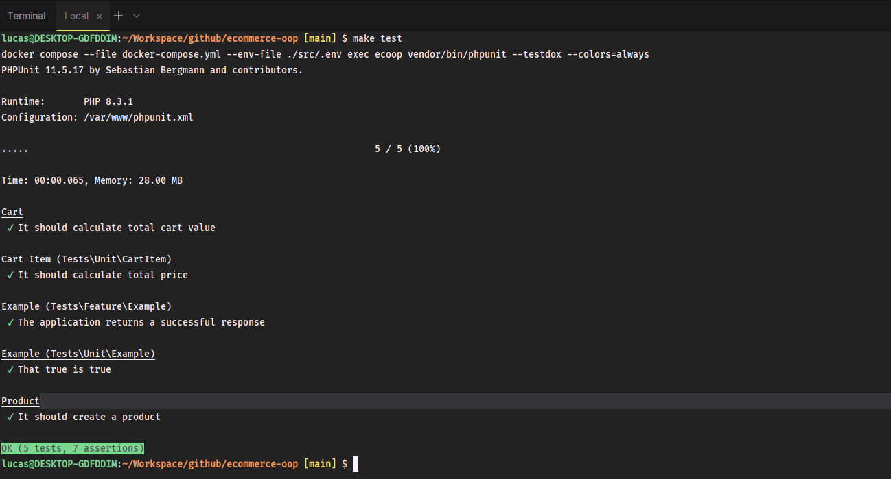
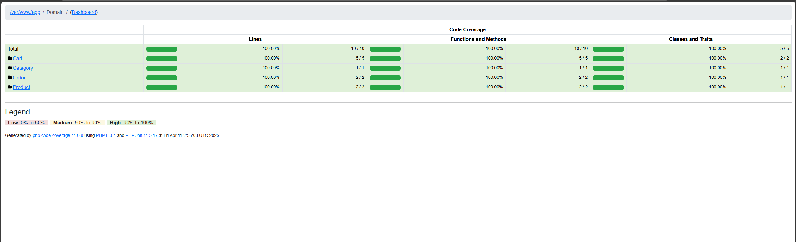

# 🛒 ECOMMERCE-OOP

This project is an example of an E-Commerce application using **PHP**, **Laravel**, and **Object-Oriented Programming (OOP)** principles. The architecture is inspired by **Domain-Driven Design (DDD)**, organizing responsibilities into clear domains such as `Product`, `Cart`, `Category`, and `Order`.

---

## 🎯 PURPOSE

The goal is to demonstrate how to apply clean OOP practices in the backend of an E-Commerce system, with unit tests, modular structure, and Docker-based development environment.

---

## 🐳 DOCKER ENVIRONMENT

The entire project is set up to run via Docker. A `Makefile` is provided to simplify common commands and bootstrap the environment quickly.

### ⚙️ REQUIREMENTS

- Docker
- Docker Compose
- Make

---

## 🚀 SETUP (FIRST RUN)

```bash
make go
```

This command will:

1. Start Docker containers
2. Install Composer dependencies
3. Run database migrations
4. Set required permissions





---

## 📦 AVAILABLE MAKE COMMANDS

| Command             | Description                                                         |
|---------------------|---------------------------------------------------------------------|
| `make go`           | Build containers, install dependencies, migrate DB, fix permissions |
| `make down`         | Stop and remove Docker containers                                   |
| `make sh`           | Enter the application container shell (`sh`)                        |
| `make logs`         | View Docker logs (tail -f)                                          |
| `make migrate`      | Run Laravel migrations                                              |
| `make seed`         | Run Laravel database seeders                                        |
| `make rollback`     | Rollback the last Laravel migration                                 |
| `make clear`        | Clear Laravel caches (config, view, route, optimize)               |
| `make permissions`  | Fix permissions for `storage` and `bootstrap/cache`                 |
| `make test`         | Run all unit tests using PHPUnit                                    |
| `make test-report`  | Generate a test coverage report in `report/`                        |
| `make log`          | Tail Laravel logs                                                   |
| `make horizon`      | Start Laravel Horizon (if using queues)                             |

---

## 🧪 RUNNING TESTS

To execute all unit tests:

```bash
make test
```



To generate an HTML coverage report:

```bash
make test-report
```



The coverage report will be available in the `report/` directory.

---

## 📁 PROJECT STRUCTURE

```
src/
└── app/
    └── Domain/
        ├── Product/
        ├── Cart/
        ├── Order/
        └── Category/
```

All business logic is encapsulated inside the `Domain` layer following DDD principles.
